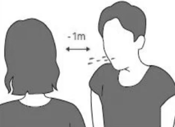

# Coronavirus COVID-19

![ Coronavirus Covid-19 \[Credits Numerama\]](.gitbook/assets/screen-shot-2020-03-15-at-22.21.30.png)

## Qu'est-ce que le Coronavirus ?

Les coronavirus sont un type de virus. Il en existe de nombreux types différents, et certains provoquent des maladies. Un type nouvellement identifié a provoqué une récente épidémie de maladie respiratoire, appelée aujourd'hui COVID-19 \(qui signifie Corona Virus Disease 2019.

## Comment ce nouveau coronavirus s'est-il transmis aux humains ?

Le COVID-19 est apparu à Wuhan, une ville de Chine, en décembre 2019. Bien que les responsables de la santé tentent encore de déterminer la source exacte de ce nouveau coronavirus, les premières hypothèses ont été émises sur le lien possible avec un marché de fruits de mer à Wuhan, en Chine. Certaines personnes qui ont visité le marché ont développé une pneumonie virale causée par le nouveau coronavirus. Une étude publiée le 25 janvier 2020 indique que la personne chez qui le premier cas a été signalé est tombée malade le 1er décembre 2019 et n'avait aucun lien avec le marché des fruits de mer. Des enquêtes sont en cours sur l'origine et la propagation de ce virus.

## Comment le COVID-19 se propage-t-il ?

Des informations récentes montrent que COVID-19 peut être transmis de personne à personne. On constate également une propagation communautaire. La propagation communautaire signifie que des personnes ont été infectées par le virus dans une zone particulière, y compris certaines personnes qui ne savent pas exactement comment ou où elles ont été infectées. COVID-19 a été détecté chez des personnes dans toute la Chine et dans plus de 100 autres pays, dont malheureusement notre pays, la Mauritanie. Le virus se transmet par la projection des gouttelettes lors d’une toux ou d’un éternuement, ou bien tout simplement lors d’une discussion face à face pendant au moins 15 minutes.

## Quelle est la période d'incubation dans le cas du COVID-19 ?

Il semble que les symptômes apparaissent chez les personnes après 2 à 14 jours suivant l'exposition au virus.

## Quels sont les symptômes du COVID-19 ?

Bien que L'Organisation mondiale de la Santé \(OMS\) a indiqué que 80 % des cas de coronavirus présentent des symptômes légers, voici les principaux symptômes qui ont été observés chez les personnes ayant contracté le virus : 

## Taux de mortalité 

| Tranche d'age  | Taux de décès par la maladie |
| :--- | :--- |
| 0-9 ans | 0% |
| 10-19 ans | 0.2% |
| 20-29 ans | 0.2% |
| 30-39 ans | 0.2% |
| 40-49 ans | 0.4% |
| 50-59 ans | 1.3% |
| 60-69 ans | 3.6% |
| 70-79 ans | 8% |
| 80 ans ou +  | 14.8% |

## Pourquoi est-il si crucial d'éviter les événements et de se mettre en quarantaine ? 

![\[version adapt&#xE9;e de la source : CDC\]](.gitbook/assets/screen-shot-2020-03-14-at-22.03.46.png)

On parle ici d" 'aplatir la courbe" : c'est-à-dire on essaiera en adoptant les consignes de protection de ralentir le taux d'augmentation des infection par jour. Cela ne garantie pas que le nombre total des infectés va diminuer ou que l'épidémie va affecter moins de personnes, mais tout simplement le but est de ralentir le rythme d'arrivée des nouveaux cas aux hôpitaux afin d'alleger la charge sur nos médecins et nos infrastructures. 

